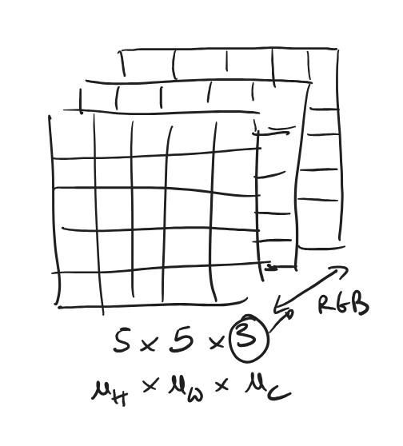
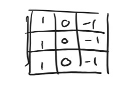
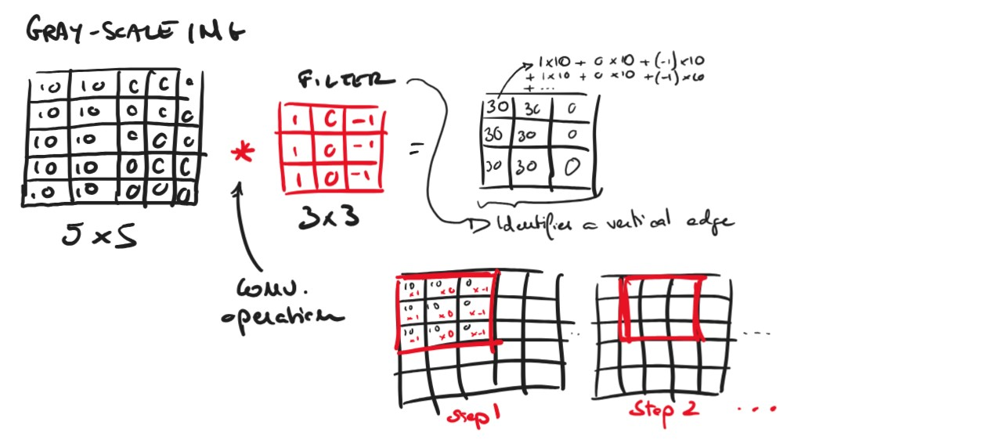
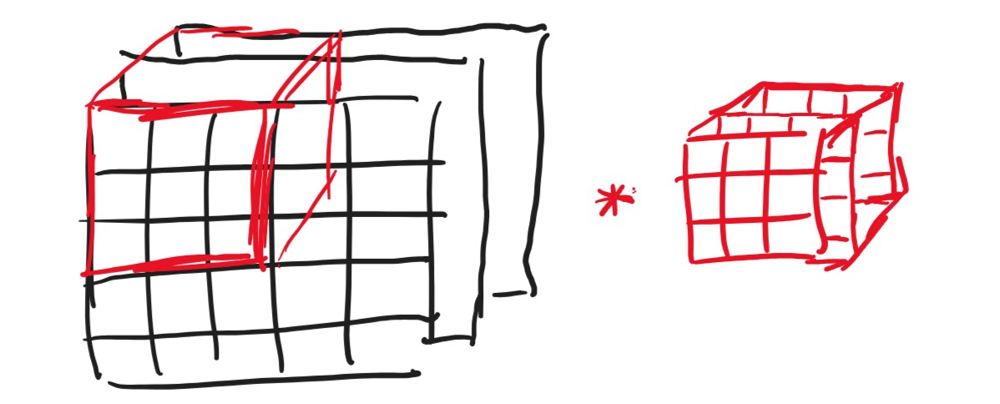

# Convolutional Neural Networks

## 1. The Basics
The base use case for CNNs is **image processing**.  
Key points: 
 * CNN architectures are based on taking images as output.  
 * Images are represented as a cube, with a height and width and a number of channels. See below image.

In the picture above, images are repesented as a matrix of $n_H$ x $n_W$ x $n_C$.

### 1.1. Filters and Convolutions
CNNS are based on the concept of **filters**.  
Filters are also matrices, that are applied on the image through **convolutions**. 

An intuitive example of filter that is aimed at highlighting **vertical edges** is the following: 

Filters allow the Network to learn to discover features in the image. The example filter above would discover vertical edges.  
Let's see how. 

A convolution operation between the input (image) and a filter goes like this:

The convolution operation takes the filter and applies it on the different areas of the image, one row at a time, as shown in the image:
 * moving the filter right one step at a time, 
 * multiplying element-wise the filter elements and the filtered zone on the image
 * summing up all the elements

That means that doing a convolution on a 5x5 image with one 3x3 filter will generate a 3x3 matrix. 

When considering RGB images, filters **need to have the same number of channels as the image**, so filters become volumes with depth $n_C$. 

The convolution, then, looks like this: 

---
# Unstructured notes
 * ResNets reason of being is to help to remove the problem of Vanishing Gradients