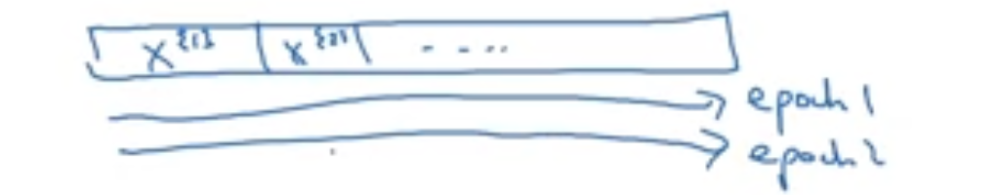
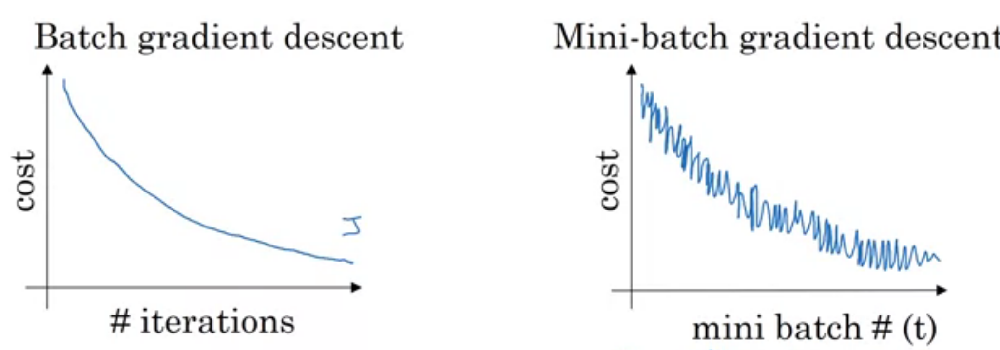
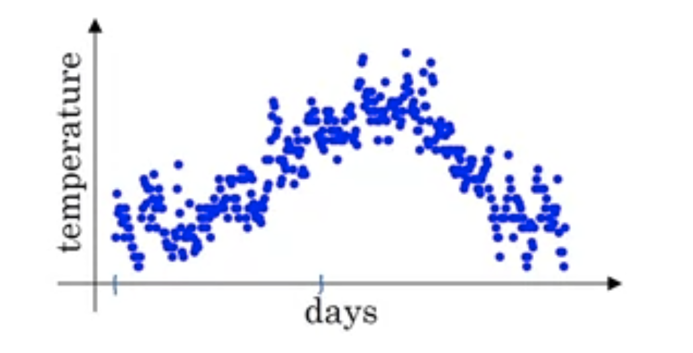
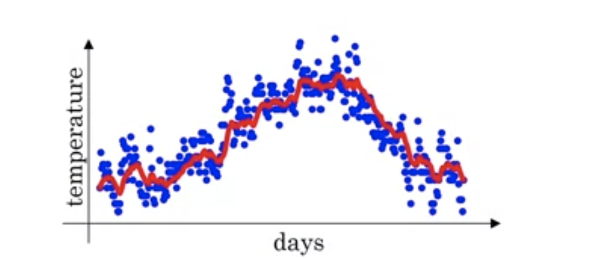
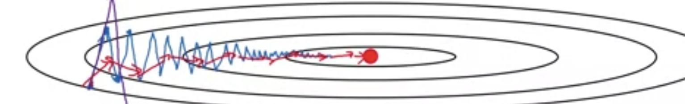
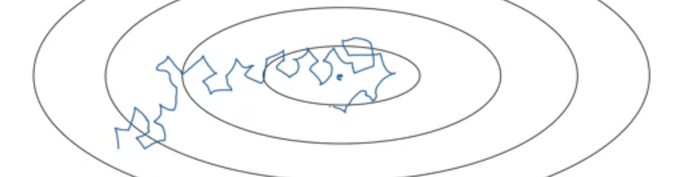

# Optimization Algorithms
Notes from the Deep Learning Specialization. .

## 1. Mini-batch Gradient Descent
The logic is that if you have 5.000.000 training examples, it is inefficient to process them all to do just one step of GD. <nr>
A better alternative is to **split** the training set in **mini batches**. 

It is then proven that if you start applying GD on mini batches, the algorithm will perform better (runs **faster**). 

A batch is denoted $X^{\{t\}}, Y^{\{t\}}$. 

So the algorithm becomes the following: 
 1. Perform Forward Propagation on $X^{\{t\}}$
 2. Calculate the Loss, considering that the forula uses $m = t$ (number of training examples)
 3. Perform Backpropagation

 Going through the entire training set once (so x times mini-batches), is also called **an Epoch** of training. 
 So the epoch is when you have done a full pass over the whole training set. 

 

 Note that the fact that we're training on small batches, will make the plot of the cost function more "noisy", compared to standard batch grandient descent. 

 

 ### 1.1 The Batch Size
 Some naming conventions: 
  * **Batch Gradient Descent** is when $t = m$
  * **Stochastic Gradient Descent** is when $t = 1$

BGD has the negative aspect that it takes **too long per iteration**.  
SGD is very inefficient (makes poor usage of vectorization).

In general you want a value of $t$ that is in-between those two. 

**Some Guidelines for choosing $t$**  
 * If the training set is small, use BGD
 * Try choosing batch-sizes that are **multiple of 2**: 64, 128, 256, 512, 1024 are the most common.
 * Make sure that $t$ examples fit in memory.

## 2. Gradient Descent with Momentum
### 2.1. Exponentially Weighted Averages
When you have time series that are noisy, you can "smoothe" the curve by, instead of plotting the data points, plotting a curve that weights the previous value more than the current value. 

So if this is the plot of each data point: 

and you apply the following: $v_t = 0.9v_{t-1} + 0.1v_t$, then you will have a smoothed-out plot that looks like this: 

### 2.2. GD with Momentum
The exponentially weighted averages are typically used in GD with momentum.  
GD suffers when using bigger learning rates, of zig-zagging, which usually pushes one to use smaller learning rates (to avoid diverging).  
But smaller learning rates take **a lot of time**. 

This is why you can use GD by applying exponentially weighted average:  
Compute:  
$V_{dW} = \beta.V_{dW} + (1-\beta)dW $ 
$V_{db} = \beta.V_{db} + (1-\beta)db $ 
$W = W - \alpha.V_{dW}$

This is what you get: 

That also means that now you have an extra **hyperparameter**: $\beta$. In practice, you almost always use $\beta = 0.9$.

## 3. RMSprop
Very similar to GD with momentum, RMSprop follows these formulas: 
$S_{dW} = \beta.S_{dW} + (1-\beta)dW^2$ 
$S_{db} = \beta.S_{db} + (1-\beta)db^2$ 
$W = W - \alpha.\frac{dW}{\sqrt{S_{dW}}}$

This has the effect of taking the parameters with the steepest descent on the cost "curve" and limiting the step on those parameters, thus avoiding divergence.

## 4. Adam 
Takes momentum and RMSprop and puts them together. 

This applies when using mini-batches (batch size: $t$). The steps are: 
 * Compute $dW, db$
 * Compute $V_{dW} = \beta_1.V_{dW} + (1-\beta_1)dW $
 * Compute $S_{dW} = \beta_2.S_{dW} + (1-\beta_2)dW^2$
 * Perform Bias Correction: 
    * $ V_{dW}^{Corrected} = \frac{V_{dW}}{(1 - \beta_1^t)} $
    * $ S_{dW}^{Corrected} = \frac{S_{dW}}{(1 - \beta_2^t)} $
 * Update the weights: $W = W - \alpha.\frac{V_{dW}^{Corrected}}{\sqrt{S_{dW}^{Corrected}} + \epsilon} $

The $\epsilon$ is used to avoid numerical underflows. 

Recommended values are: 
 * $\alpha$ : needs tuning
 * $\beta_1 = 0.9$ 
 * $\beta_2 = 0.999$ 
 * $\epsilon = 10^{-8}$

## 5. Learning Rate decay
This means slowly reducing $\alpha$ to accelerate convergence. This is because typically the following happens: 

So by reducing $\alpha$ when you get closer to the minimum, you accelerate convergence and avoid this "circling around the minimum".

Concretely this is done by setting: 

$\alpha = \frac{1}{1 + decay * epoch}*\alpha_0$

Where the decay is the decay rate (**hyperparameter**) and epoch is the number of the current epoch (1, 2, 3, ...).  
That means that while the epochs go, $\alpha$ decreases.

Learning Rate Decay is a bit lower on Andrew's list of paramters that he tunes.

## Note on Local Optima
Note that the fear of ending up in local optima is actually less and less relevant in high feature dimensions. 

That because in a 2-dimensional space, a local optimal is a problem, but when you have 20.000 parameters, the **probability** that all the parameters are in an local optimum is **very low**. 

**Plateaus** are more of a problem: areas where the gradient is close to zero for a long time. This is because it will take a long time to get off the plateau.