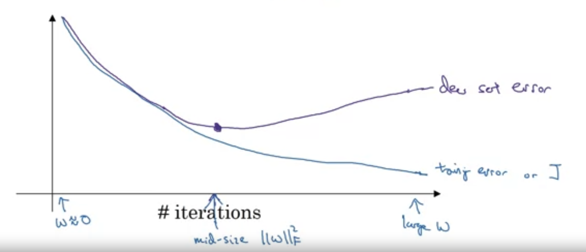
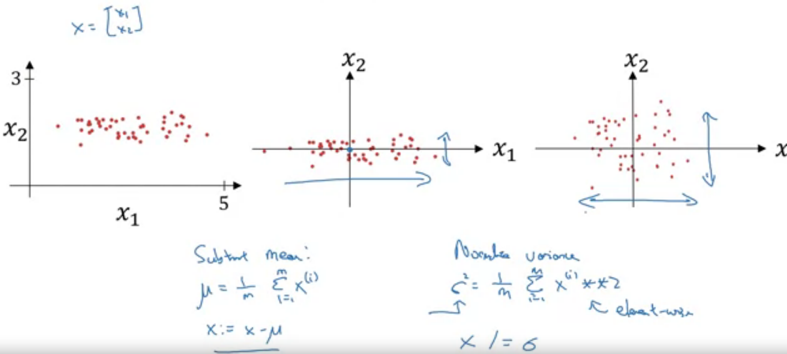
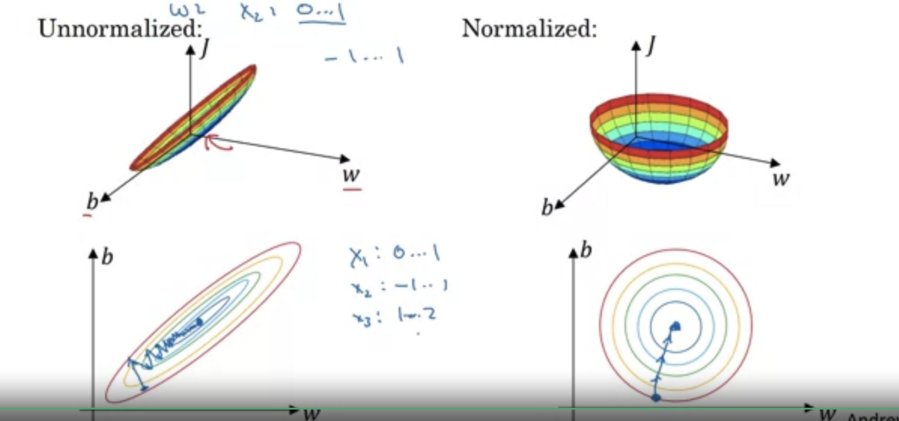

# Tuning Networks

This page covers key notes in tuning neural networks. 

<a name="1"></a>

## 1. Regularization

Regularization basically **penalizes** weights being too large.

<a name="1.1"></a>

### 1.1. Logistic Regression
In Logistic Regression (simplest form of a NN), regularization is defined in the *Cost Function* like this: 

$
J(w, b) = \frac{1}{m} (\sum_{i=1}^mL(\hat{y}^{i}, y^{i})) + \frac{\lambda}{2m}||W||^2
$

This is called **L2 Regularization** because it uses the **norm of W**. <br>
**L1** Regularization uses the absolute value of W, but it's much less used. 

Remember that the **norm** is calculated as: 

$ ||W||^2 = \sum_{j=1}^{n}w_j^2 = W^T.W $

<a name="1.2"></a>

### 1.2. Neural Network 
For a NN, you have *multiple W* matrices, hence the Regularization becomes: 

$ J( W^{[i]}, b^{[i]}, ... , W^{[L]}, b^{[L]} ) = \frac{1}{m} (\sum_{i=1}^mL(\hat{y}^{i}, y^{i})) + \frac{\lambda}{2m}\sum_{l=1}^L||W^{[l]}||^2$ 

This matrix norm is called the **Forbenius Norm**. <br>

<a name="1.3"></a>

### 1.3. Change in the calculation of Gradient

With Regularization, the gradient in a NN changes and becomes: 

$
dW^{[l]} = (grad) + \frac{\lambda}{m}W^{[l]}
$

Because of this, L2 Regularization is also called **Weight Decay**. <br>
That's because when I perform the update of the weights, the above formula actually ends up meaning that you substract a small portion of the weights to the weights matrix. 


<a name="2"></a>

## 2. Dropout Regularization

Dropout Regularization basically consists in randomly removing, for each training example, some neurons in the different layers in the network. 

The most used Dropout technique is **Inverted Dropout**. 

<a name="2.1"></a>

### 2.1. Inverted Dropout
To understand drop out, check this video: [Dropout Regularization (Coursera - Deep Learning Specialization)](https://www.coursera.org/learn/deep-neural-network/lecture/eM33A/dropout-regularization)<br>
*Inverted Dropout* is calculated like this: 
```
# Take a layer
# Define a keep_prob value
# That is the threshold under which the neuron is kept unaltered. 
keep_prob = 0.8 

# Create a vector with the same shape of the "a" vector of that layer that will contain random numbers between (0, 1)
# For each value, if it's lower than the keep_prob value, set to True (= keep the neuron)
d3 = np.random.rand(a3.shape[0], a3.shape[1]) < keep_prob

# Element-wise Multiply a3 by d3
# That concretely sets to zero all the neurons to "remove"
a3 = a3 * d3

# Multiply by the inverse of the keep_prob
# That is to scale up the remaining values
a3 /= keep_prob
```

Note that the `keep_prob` value is **per layer**, which allows you to decide how to regularize each layer. 

**IMPORTANT**: you **do not** use dropout at test time, because you don't want to have a randomly calculated value at test time!

**Why does Dropout works?**<br>
Because by randomly removing neurons, the network learns to not rely too much on specific features, which means that weights are **more spread**. 

In practice, dropout is **widely used in Computer Vision**. 

# 2. Other ways to reduce Overfitting
## 2.1. Data Augmentation
Data Augmentation is an *ok* way to get more training examples without having to find more data. <br>
In the computer vision world, you would take pictures and apply transformations like:
 * flipping the image
 * scaling it
 * random distortions
 * etc.

It's not as good as getting more data, since basically the new data is somehow correlated to other data, but it's a way to **reduce overfitting**. 

## 2.2. Early Stopping
That means stopping the training before convergence.<br>



 * You plot the training and dev (CV) error
 * You stop training when the dev (CV) error start raising

Andrew Ng doesn't like too much this technique. He prefers L2.

# 3. Normalization
Normalizing means basically removing the mean and dividing by the variance. <br>
The following graphs explains well the concept:



It basically makes sure that x1 and x2 have the same mean (0) and the same variance (how spread the values are).

**Why is Normalization important?** <br>
Because that **accelerates Gradient Descent**, so it makes the optimization algorithm converge faster. <br>
That is because if the values are not normalized, the cost function's shape might be so asymmetric that you need to use a very small learning rate to avoid the gradient descent to *zig-zag* towards the minimum. 



Consider that normalization is not always usefull, but **it's never harmfull** so you might as well always use it! 

# 4. Weight Initializtion
Initialization strategy always depends on the activation function for the layer. <br>
So you want to initialize differently based on the layer. 

In general, you want to randomly initialize weights and multiply by a factor that will reduce the weights based on the **number of inputs that feed into the layer**.<br>

**Why is that**? <br>
Basically because when you calculate $ z = W_1.X_1 + W_2.X_2 + ... + W_n.X_n $, the higher $n$ is, the smaller you want to initialize the weights, to avoid having a z that is too big (hence going towards exploding gradients).<br>
Initialization will allow my weights to not explode nor decay too quickly. 

For **ReLU** layers, you want to do: 
`Wx = np.random.randn(shape) * np.sqrt(2/n[l-1])`

For **tanH** layers, instead of **2** you'll use **1**. 