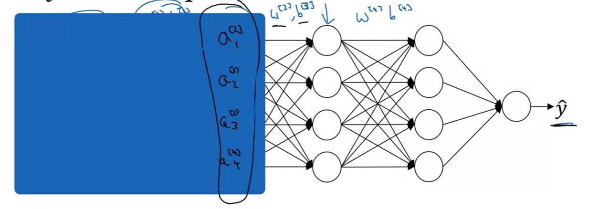

# Tuning 

This page explores the methods and best practices for hyperparameter tuning. 

## 1. Searching the Hyperparameter Space
Key points: 

1. Andrew **discourages** the use of Grid Search, and prefers the usage of **random searching** in the hyperparameter space. <br>
The justification is that with Grid Search you risk missing important values. 

2. Use a **Coarse to Fine** scheme. <br>
Start with a wide region of the hyperparameter space and then zoom in into a smaller region and redo random search. 

When using random search, you want to make sure to distinguish when it makes sense to search using a **uniform random distribution** or using a **log distribution** (for example). <br>
The is, for example, the case of $\alpha$, where you want to use a log distribution for the search, meaning picking random values from a log distribution. <br>
In pyhon you do: 
```
r = -4 * np.random.rand()
alpha = 10**r
```
The first line samples uniformely in the space $10^{-4}$ to $1$. <br>

## 2. Batch Normalization
There are two main reasons for Batch Normalization: 
1. It speeds up learning
2. It makes the model better at generalizing, because it makes it more robust to changing data distributions: **Covariate Shift**.

There are multiple things that you can normalize: 
 * The input $X$
 * The hidden layers activations $a^{[l]}$ (or $z^{[l]}$). Actually the **most common** is to normalize $z^{[l]}$.

To normalize $z^{[l]}$, you basically calculate mean and variance. <br>
Remember that normalization means bring the distribution to have mean $0$ and variance $1$. 

$\mu = \frac{1}{m}\sum_iz^{(i)}$<br>
$\sigma^2 = \frac{1}{m}\sum_i(z^{(i) - u})^2 $<br>
$z_{norm}^{(i)} = \frac{z^{(i)} - \mu}{\sqrt{\sigma^2 + \epsilon}} $ <br>
where $\epsilon$ is used to avoid divison by zero. 

Sometimes you don't want to have mean 0 and variance 1. <br>
Then what you do is you compute:<br>
$ \tilde{z}^{(i)}  = \Gamma.z_{norm}^{(i)} + \Beta $ <br>
where $\Gamma$ and $\Beta$ are **learnable parameters** and both have dimension $(n^{[l]}, 1)$ where $n[l]$ is the number of neurons in layer $l$. <br>
As any other parameter of the network, during back propagation you will compute the gradient of the loss function with respect to $\Gamma$ and $\Beta$.

When working with **mini-batches**, you apply batch norm on the mini-batch. That means that you actually compute the mean and variance only on the mini-batch data. 

To note that if you do batch normalization the $b$ (bias) term can be avoided, since when you normalize you remove the mean, hence that $b$ is canceled out. 

### 2.1. Speeding up Learning
When data is not normalized, the model will learn parameters that have a different distribution, hence some will be large, some small. <br>
If parameters' distributions are so different, the gradients of the weights related to one feature will be significantly larger than the gradient of the other feature. <br>
That means that GD will zig-zag a lot to get to the minimum, which risks diverging, hence requires a lower learning rate, hence takes longer to converge. <br>


### 2.2. Covariate Shift
As said before, Batch Normalization makes the model more resilient to changing dat distributions. <br>
It is applied on **every layer** of the network, because for every layer, the input of that layer ($a^{[l-1]}$)<br>
So in this example, from the perspective of the 3rd hidden layer, $a^{[2]}$ is just an input. <br>



The problem is that at every iteration of the training, the values of $a^{[2]}$ will change as a result of the learning process. That means that the distribution can also change, and that can impact the capacity of layer 3 to actually learn something, since its inputs keep changing. <br>

Batch Norm, in this case, will make sure that the distribution of $a^{[2]}$ always has mean 0 and variance 1, and that helps Layer 3 to have "stable data" to learn from. 

### 2.3. Batch Norm on test sets
The problem with the test phase is that when testing (or inference), **you do not use mini-batches**, and might run each test example through the NN one example at a time.<br>
That means that **you cannot calculate $\mu$ and $\sigma$** . <br>

What you would then do is estimate $\mu$ and $\sigma$ from the training set.<br>
But since you have not calculated $\mu$ and $\sigma$ on the entire training set but only on mini-batches, what you do, to have an estimated $\mu$ and $\sigma$ to use for test time, is, **during training** to use **Exponentially Weighted Averages** to **cumulatively** calcualte an overall $\mu$ and $\sigma$ to use at test time. 